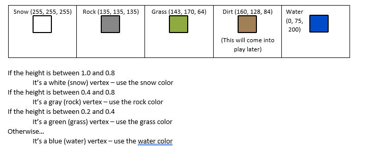
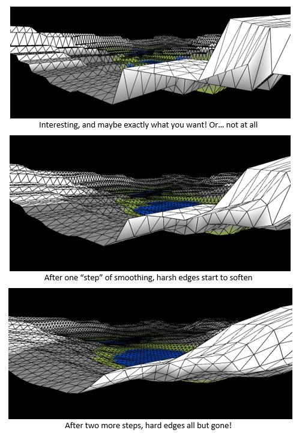

# Procedural Terrain Generator and Scene Renderer Project READMEs
## **1. Procedural Terrain Generator**:
This project is Procedural Terrain Generator. It takes information from PNG files and then, using an generation algorithm I implemented involving height maps, create the terrain
in a 3D space. I will detail the important components of the project down below.

#### Here is a video I created demonstrating the projects functionality:
https://user-images.githubusercontent.com/68438637/157127129-11e567e9-058c-4677-963a-de0f5d0cdd48.mp4

#### Here is a video I created briefly explaining the project's class structure:
https://user-images.githubusercontent.com/68438637/157123926-b6256aa8-b919-45e6-8011-4558d72dae4d.mp4

### The main functions of this project:
- Create a grid of customizable size and detail using the GUI controls
- Load terrain data from a PNG file (files in "data" folder in repository) 
- Load the the terrain data as 3D terrain data on the grid the user creates. 
- Maps colors to terrain elevation, terrain of highest elevation marked by white(snow), terrain of lowest is marked as blue(water)
- User is able to adjust the appearance of the grid through GUI sliders.
- Texture smooth to the users desired look of the terrain.

### Details on drawing grid algorithm:
- I created an ArrayList of vectors that store the vertex data of the points.  **Java code**: points = new ArrayList<PVector>();
- I created an ArrayLists of integers that store the triangle index data. Each triangle needs 3 integers, each of which reference the vertex data in the first arraylist.
- Using these 2 data structures. I draw thousands of polygons that ultimately create the 3D terrain, this is an industry standard for how terrain is created in 3D applications.

### Details on heightmapping algorithm:
 Here is the pseudocode for the algorithm I implemented:
 

### Details on texture smoothing algorithm:
For each vertex we are smoothing:
- Sample the position of the vertext and its neighboring vertices
- Take the average of all the y-values of each of those vertices
- Assign the average value to the y-value of the current vertex

