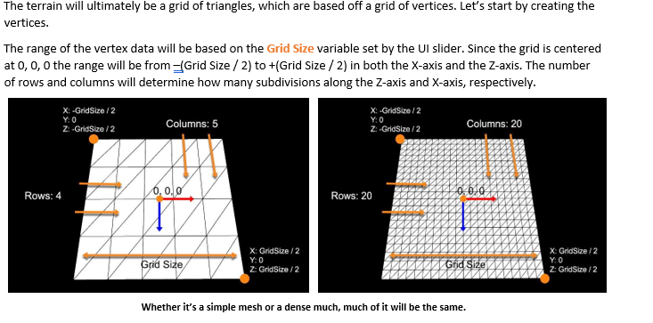

# ProceduralTerrainGeneratorandSceneRendererinJava
## **1. Procedural Terrain Generator**:
This project is Procedural Terrain Generator. It takes information from PNG files and then, using an generation algorithm I implemented involving height maps, create the terrain
in a 3D space. I will detail the important components of algorithm below.

### The main functions of this project:
- Create a grid of customizable size and detail using the GUI controls
- Load terrain data from a PNG file (files in "data" folder in repository) 
- Load the the terrain data as 3D terrain data on the grid the user creates. 
- Maps colors to terrain elevation, terrain of highest elevation marked by white(snow), terrain of lowest is marked as blue(water)
- User is able to adjust the appearance of the grid through GUI sliders.
- Texture smooth to the users desired look of the terrain.

### Details on creating grid algorithm:
- I created an ArrayList of vectors that store the vertex data of the points.  **Java code**: points = new ArrayList<PVector>();
- I created an ArrayLists of integers that store the triangle index data. Each triangle needs 3 integers, each of which reference the vertex data in the first arraylist.
-Using these 2 data structures. I draw thousands of polygons that ultimately create the 3D terrain, this is an industry standard for how terrain is created in 3D applications.

### Details on heightmapping algorithm:
  - here
### Details on texture smoothing algorithm:
  - 

#### Here is a video I created demonstrating the projects functionality:

